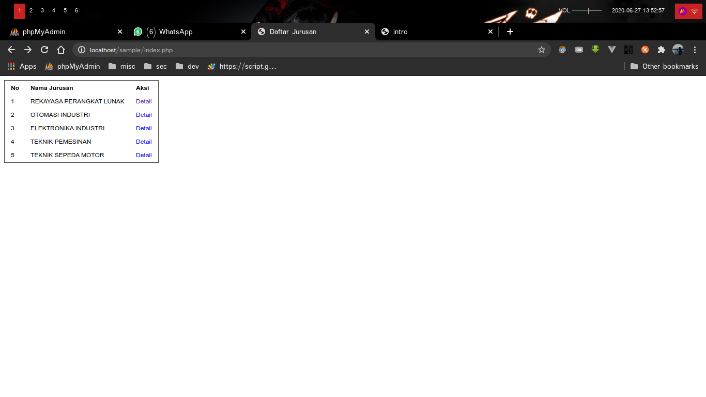
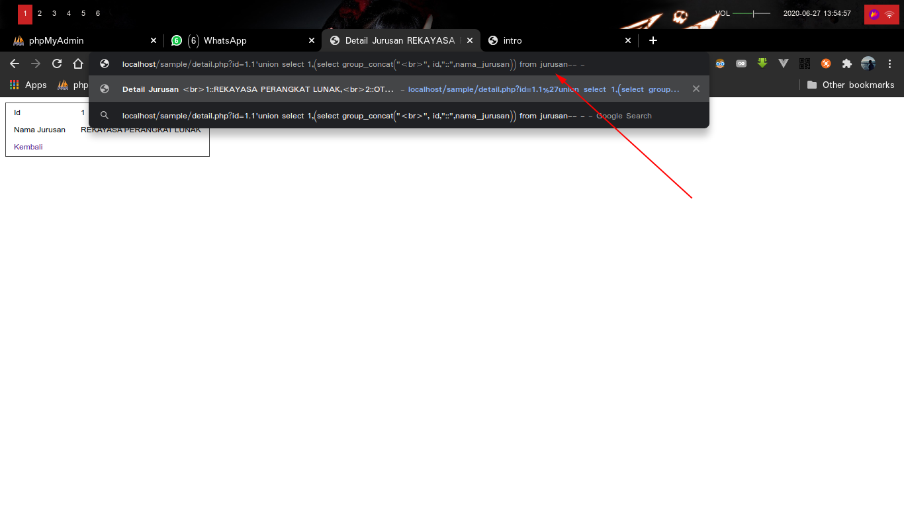
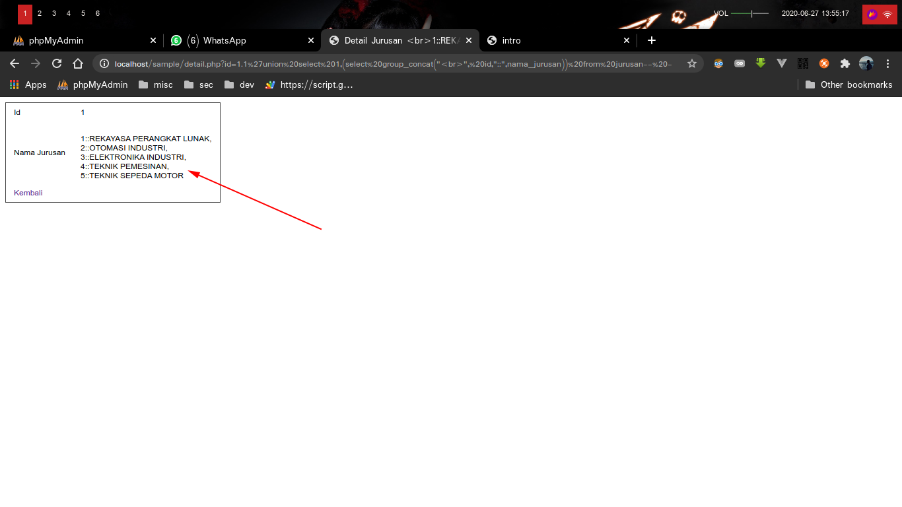
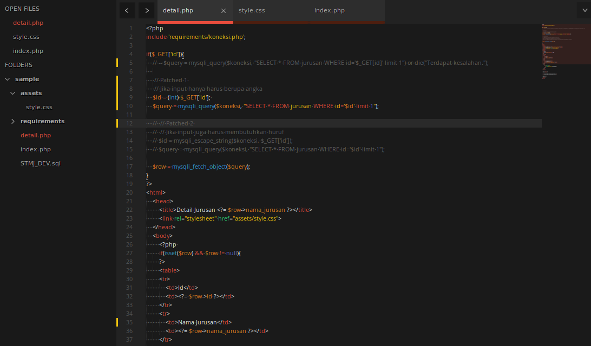
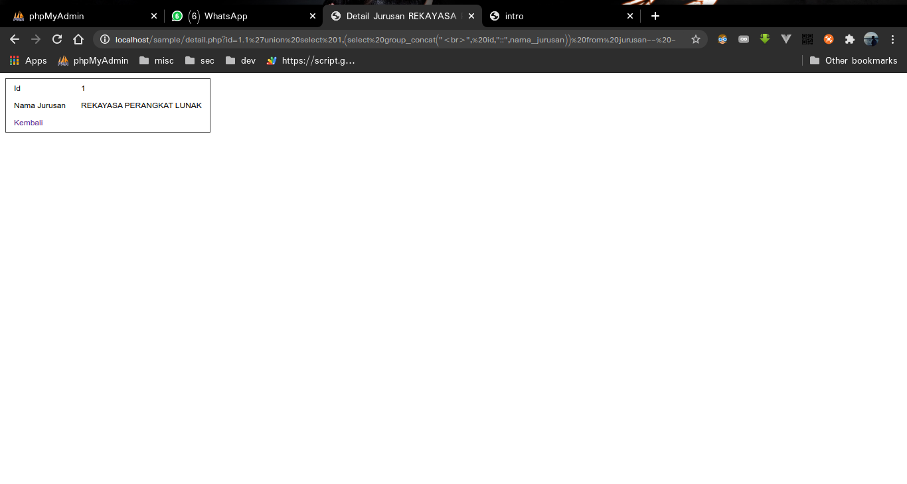

# SQL-Injection

## Table of Contents

* [SQL-Injection](#sql-injection)
	* [Apa itu SQL-Injection ?](#apa-itu-sql-injection)
	* [Contoh SQL Injection](#contoh-sql-injection)
	* [Bagaimana cara mencegah SQLi ?](#bagaimana-cara-mencegah-sqli)
	* [Tambahan](#tambahan)
	* [Kontribusi](#kontribusi)


## Apa itu SQL-Injection ?

Di kutip dari http://id.wikipedia.org
    
>Injeksi SQL (Bahaasa Inggris: SQL Injection)adalah sebuah teknik yang menyalahgunakan sebuah celah keamanan yang terjadi dalam lapisan basis data sebuah aplikasi. Celah ini terjadi ketika masukan pengguna tidak disaring secara benar dari karakter-karakter pelolos bentukan string yang diimbuhkan dalam pernyataan SQL atau masukan pengguna tidak bertipe kuat dan karenanya dijalankan tidak sesuai harapan. Ini sebenarnya adalah sebuah contoh dari sebuah kategori celah keamanan yang lebih umum yang dapat terjadi setiap kali sebuah bahasa pemrograman atau skrip diimbuhkan di dalam bahasa yang lain.

Dikutip dari http://owasp.org

>A SQL injection attack consists of insertion or “injection” of a SQL query via the input data from the client to the application. A successful SQL injection exploit can read sensitive data from the database, modify database data (Insert/Update/Delete), execute administration operations on the database (such as shutdown the DBMS), recover the content of a given file present on the DBMS file system and in some cases issue commands to the operating system. SQL injection attacks are a type of injection attack, in which SQL commands are injected into data-plane input in order to effect the execution of predefined SQL commands.

Kesimpulan yang dapat ditarik dari 2 kutipan diatas adalah
> SQL Injection merupakan sebuah celah keamanan yang memanfaatkan input pengguna yang tidak difilter dengan baik, dan kemudian dieksekusi oleh DBMS (Database Management System).

## Contoh SQL Injection

Untuk melihat contoh serangan SQL Injection , 

1. Pindahkan folder ```sample```ke dalam htdocs,
2. Setelah itu, buat sebuah database baru dengan nama STMJ_DEV
3. Import file ```STMJ_DEV.sql``` yang terdapat di dalam folder ```sample```
4. Ubah file ```sample/requirements/koneksi.php```, Sesuaikan dengan username & password mysql kalian. 
5. Kemudian buka ```localhost/sample/```



6. Klik detail pada salah 1 Jurusan
7. Tambahkan script dibawah pada parameter id
```
.1'union select 1,(select group_concat("<br>", id,"::",nama_jurusan)) from jurusan-- -
```



8. Dan semua data didalam table jurusan akan ter-dump , Bayangkan jika ini table user / credit card. pasti akan sangat berbahaya.




## Bagaimana cara mencegah SQLi ?

Untuk dapat mencegah serangan sql injection ini, sebisa mungkin  minimalisir user ber-interaksi langsung terhadap DBSM dan filter semua inputan user yang berhubungan dengan DBSM .


Sebagai contoh, buka ```sample/detail.php``` dan beri commenting pada bagian $query, Selanjutnya uncomment ```Patching 1``` / ```Patching 2``` .



Dan coba jalankan kembali ```sample``` tadi. 



## Tambahan
Sebenarnya masih ada 1 lagi cari patching bug sqli yang umum, yaitu menggunakan prepared statement. Untuk tutorial menggunakan prepared , bisa di buka pada link dibawah

[https://www.php.net/manual/en/mysqli.prepare.php](https://www.php.net/manual/en/mysqli.prepare.php)

## Kontribusi

Ingin ber-kontribusi dengan menambah materi / membagikan source code / mengoreksi kesalahan ? Silahkan hubungi saya

>[Telegram](t.me/defrindr)

>[Whatsapp](wa.me/6285604845437)

